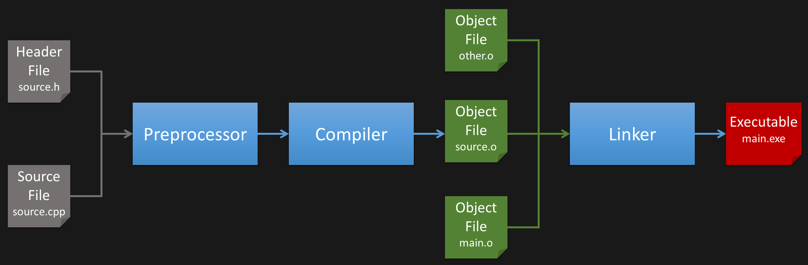

# Compilation Primer

Compiling C/C++ is a multi-stage process involving multiple different tools.
Ignoring the build system, these are the main stages when invoking the compiler (e.g. GCC, Clang, MSVC).



- The **preprocessor** takes in the source file and resolves preprocessor directives (e.g. `#if`, `#include`, `#define`).

- The **compiler** receives the output of the preprocessor and translates the C/C++ code to _object code_ (binary).
  This object code cannot be executed directly as it's missing information needed by the operating system to create a process.

- The **linker** combines multiple object files with existing libraries into an executable (or library).
  Executables can be run directly; libraries are consumed by other C/C++ projects.

The linker is concerned with **symbols**, which are identifiers for functions, variables, etc.
Symbols can have different visibility, which is also referred to as **linkage**.

## Static vs. Dynamic Library

Libraries commonly come in two different types.

- **Static** libraries are just packed object files.
  Like any object file, the linker combines them into the target executable.
  Since all code of static libraries is located inside the executable, the libraries themselves are not needed for execution.

- **Dynamic** libraries are a bit more complex.
  Contrary to static libraries, code remains inside the library, hence the library must be present during execution.
  However, this mechanism allows the library to be replaced without having to re-link the executable.
  The **loader** is in charge of finding the dynamic libraries needed by an executable.

### Linux

In Linux-like operating systems static libraries typically use `.a` (archive) as file extension (e.g. `libcrypt.a`); dynamic libraries typically use `.so` (shared object).

The `ar` utility can be used to create, inspect, and modify static libraries.

```
$ ar t /usr/lib/x86_64-linux-gnu/libcrypt.a
libcrypt_la-alg-des-tables.o
libcrypt_la-alg-des.o
libcrypt_la-alg-gost3411-2012-core.o
libcrypt_la-alg-gost3411-2012-hmac.o
libcrypt_la-alg-hmac-sha1.o
libcrypt_la-alg-md4.o
libcrypt_la-alg-md5.o
…
```

The `nm` utility can be used to inspect which _symbols_ are provided by a library
This works for static and dynamic libraries.
See `nm`'s manpage for additional information.

```
$ nm /usr/lib/x86_64-linux-gnu/libcrypt.a

libcrypt_la-alg-des-tables.o:
0000000000002000 R _crypt_comp_maskl
0000000000001000 R _crypt_comp_maskr
0000000000007000 R _crypt_fp_maskl
0000000000005000 R _crypt_fp_maskr
000000000000b000 R _crypt_ip_maskl
…

$ nm --dynamic  lib/x86_64-linux-gnu/libcrypt.so
                 U arc4random_buf@GLIBC_2.36
                 U __assert_fail@GLIBC_2.2.5
0000000000015da0 T crypt@GLIBC_2.2.5
0000000000015da0 T crypt@@XCRYPT_2.0
0000000000016c70 T crypt_checksalt@@XCRYPT_4.3
0000000000013460 T crypt_gensalt@@XCRYPT_2.0
0000000000016ac0 T crypt_gensalt_r@XCRYPT_2.0
…
```

The `ldd` utility can be used to list the dynamic libraries required by an executable.
It also tries to resolve these requirements, stating where the dynamic library has been found.

```
$ ldd /usr/bin/ssh
linux-vdso.so.1 (0x00007ffda6906000)
libselinux.so.1 => /lib/x86_64-linux-gnu/libselinux.so.1 (0x00007f7d6d5d0000)
libgssapi_krb5.so.2 => /lib/x86_64-linux-gnu/libgssapi_krb5.so.2 (0x00007f7d6d57e000)
libcrypto.so.3 => /lib/x86_64-linux-gnu/libcrypto.so.3 (0x00007f7d6d0fc000)
libz.so.1 => /lib/x86_64-linux-gnu/libz.so.1 (0x00007f7d6d0dd000)
libc.so.6 => /lib/x86_64-linux-gnu/libc.so.6 (0x00007f7d6cefc000)
libpcre2-8.so.0 => /lib/x86_64-linux-gnu/libpcre2-8.so.0 (0x00007f7d6ce60000)
…
```

The loader searches in directories stated in the `LD_LIBRARY_PATH` environment variable in addition to its system-wide configuration (typically `/etc/ld.so.conf`).
Additionally, an executable can provide a direct path to a dynamic library; this mechanism is referred to as [rpath](https://en.wikipedia.org/wiki/Rpath).

### Windows

In Windows, static libraries use `.lib` as file extension, where dynamic libraries use `.dll`.
However, there's a slight twist.
In Linux, you directly tell the linker which dynamic libraries to link the executable against.
However, in Windows you give the linker a _DLL import library_ which is used during linking to prepare the executable for using the corresponding `.dll` at runtime.
This DLL import library usually uses `.lib` (or sometimes `.dll.a`) as file extension.

For listing symbols of a shared library, there's the `dumpbin` utility.

```
$ dumpbin /SYMBOLS /EXPORTS C:\Windows\System32\ntprint.dll
…
122    1 0000E980 PSetupAssociateICMProfiles
123    2 00023AA0 PSetupBuildDriverList
124    3 00023680 PSetupBuildDriversFromPath
108    4 00017CD0 PSetupCheckForDriversInDriverStore
125    5 00030540 PSetupCopyDriverPackageFiles
…
```

For inspecting an executables dynamic library dependencies there's [Dependency Walker](https://www.dependencywalker.com/).

Important differences to Linux:
- The directory containing the executable file is part of the loader's DLL search path.
- There's no rpath equivalent.

Because of this, DLLs are typically placed right next to the executable.
During development this is commonly automated using a _post build action_.

### Name Mangling (C++ only)

For C code, symbol names will be identical to function and variable names.
In C++, symbol names are _mangled_ to support features like namespaces, templates, and function overloading.

A function signature like this:

    Map<StringName, Ref<GDScript>, Comparator<StringName>, DefaultAllocator>::has(StringName const&) const

gets turned into:

    _ZNK3MapI10StringName3RefI8GDScriptE10ComparatorIS0_E16DefaultAllocatorE3hasERKS0_

You can use the `c++filt` (Linux) / `undname` (Windows) tools to translate a mangled name back to its signature.
Note that name mangling is **not** standardized.

`extern "C"` can be used in C++ to disable name mangling for specific symbols.

## Manually Adding a Dependency

When manually adding a new library dependency to your project, you have to provide the compiler with the header files and the  libraries.

Let's use [GLFW](https://github.com/glfw/glfw) as an example.
The latest (at the time of writing) binary release [`glfw-3.4.bin.WIN64.zip`](https://github.com/glfw/glfw/releases/download/3.4/glfw-3.4.bin.WIN64.zip)  contains a set of header files (inside the `include` directory) and libraries for various development environments.
Note the `README.md` provides more insight into the different libraries.

- Extract the `include` folder into your project

      glfw-3.4.bin.WIN64/include → PROJECT_ROOT/external/glfw/include

- Pick the corresponding libraries and extract them as well

      glfw-3.4.bin.WIN64/lib-vc2022/glfw3.dll → PROJECT_ROOT/external/glfw/bin/win64/glfw3.dll
      glfw-3.4.bin.WIN64/lib-vc2022/glfw3dll.lib → PROJECT_ROOT/external/glfw/bin/win64/glfw3lib.dll

### Visual Studio

The following settings need to be set for _all configurations_.
Open the project properties of your project:

- Add the include path so that header files are picked up correctly:
    - Project Properties → Configuration Properties → C/C++ → General → Additional Include Directories
    - Add a new entry `$(ProjectDir)external\glfw\include`
    - This allows you to include the GLFW header with `#include <GLFW/glfw3.h>`.
      The `GLFW` subdirectory still needs to be specified as it is contained within the `include` directory.

- Add the _DLL import library_ so the linker knows about GLFW's symbols:
    - Project Properties → Configuration Properties → Linker → Input → Additional Dependencies
    - Add a new entry `$(ProjectDir)external\glfw\bin\win64\glfw3dll.lib`

- Add a _post build step_ to copy the DLL to the executables location
    - Project Properties → Configuration Properties → Build Events → Post-Build Event → Command Line
    - Add a new command `xcopy "$(ProjectDir)external\glfw\bin\win64\glfw3.dll" "$(TargetDir)" /Y /I`

Note the use of `\` as path separators.

### CMake

For CMake, I recommend adding a new target for the dependency, which has the target libraries and include path attached.
Your existing CMake target will depend on the dependency target.

```cmake
# New target representing GLFW.
add_library(glfw SHARED IMPORTED)
target_include_directories(glfw SYSTEM INTERFACE ${PROJECT_SOURCE_DIR}/external/glfw/include)
set_target_properties(glfw PROPERTIES
    IMPORTED_IMPLIB ${PROJECT_SOURCE_DIR}/external/glfw/bin/win64/glfw3dll.lib
    IMPORTED_LOCATION ${PROJECT_SOURCE_DIR}/external/glfw/bin/win64/glfw3.dll)

# Existing target of the project.
add_executable(example main.cpp) 

# Adding the dependency; this also adds GLFW's include path to example.
target_link_libraries(example PRIVATE glfw)

# Add a post build step to copy DLL dependencies to the target output directory.
add_custom_command(TARGET example POST_BUILD
    COMMAND ${CMAKE_COMMAND} -E copy_if_different $<TARGET_RUNTIME_DLLS:example> $<TARGET_FILE_DIR:example>
    COMMAND_EXPAND_LISTS)

# Set example target as Visual Studio startup project. (optional)
set_property(DIRECTORY PROPERTY VS_STARTUP_PROJECT example)
```

If there are multiple libraries, create a target for each one first, then create one overall target for the dependency, which depends on all library targets.
This way your project target can pull in all libraries of the dependency by depending on one target only.

### GCC / Clang

If you are invoking GCC or Clang manually:
- Specify the include directory with the `-I` flag.
- Add the path to the library **after** the source files as regular argument.

```
$ gcc -Iexternal/glfw/include -o main main.cpp external/bin/linux/libglfw.so
```

### Other Options

There exists a multitude of options for adding dependencies to a C/C++ project.
If you are on Linux, consider using your system package manager to install the development packages of the libraries you need.
The header files and library are typically installed in the global search path and can be found explicitly by using CMake's [`find_package`](https://cmake.org/cmake/help/latest/command/find_package.html) feature.

### Basic troubleshooting

- Compiler complains about unknown identifier when calling a function or using a type.
    - Include the corresponding header file which contains the function declaration or type definition.
    - If the problem still persists, check for circular includes.
- Compiler complains about header file not being present.
    - Check your include directories!
      Is the path correct?!
- Compiler complains about unresolved symbol.
    - The linker is not picking up the library correctly.
      Check the paths to your libraries.
- Compiler complains about duplicated symbols.
    - One of your source files contains a symbol with the same name (and external linkage) as another object file or library.
      Carefully read the error message, it tells you which symbol, and maybe even which object file it comes from.
- Compilation succeeds, but the executable crashes before getting to `main`.
    - Check that all dynamic libraries are located next to the executable.
      Double check your post build steps.

## Header-Only Dependencies

Sometimes a dependency consists of C/C++ header files only, without any source or library files.
In this case, you only have to provide the include directory to use the dependency.

### `#define IMPLEMENTATION`

However, some dependencies that are technically header-only may need you to define one preprocessor symbol before including the header file(s) in **one** source file.
In this case, the header file(s) contain declarations and implementations; yet, the implementations are not declared inline, but are guarded behind the demanded preprocessor symbol.
It is important to only define the preprocessor symbol in **exactly one** of your source files.
If the implementation is added to multiple source files, the linker will complain about duplicated symbols.

My recommendation is to use a dedicated source file for the dependency which only defines the needed preprocessor symbol and then includes the header files.

This mechanism is common with headers from the [STB](https://github.com/nothings/stb) collection.

## Debug vs. Release

Most C/C++ projects provide at least two build configurations:
- **Debug** configuration typically contains additional checks and no (or only minor) optimizations.
  This is primarily used during development or when tracking down bugs.
- **Release** configuration rarely contains debug symbols, has some checks disabled, and uses full optimizations.
  Outputs from this build configuration are commonly distributed to the end-user.

Most libraries can be used with either build configuration; however, rarely one has to use the correct library corresponding to the build configuration.
Such libraries come in a debug and a release version.
This is communicated by either having the library located in a `debug` / `release` subdirectory, or by the debug variant having a `d` attached to the filename.

MSVC complaining about mismatching _iterator debug levels_ is a good indicator for this build configuration mismatch.

## MSVC Runtime

For Windows executables there are 4 different C/C++ runtimes that can be used:
- Multi-threaded (MT)
- Multi-threaded Debug (MTd)
- Multi-threaded DLL (MD)
- Multi-threaded Debug DLL (MDd)

The _Multi-threaded_ part of the name is mostly a misnomer nowadays, focus your attention on the suffix.
The _DLL_ variant is the _dynamic_ runtime, contained within a DLL that is provided by the OS when launching the executable.
The _non-DLL_ variant is the _static_ runtime, which gets linked into the executable, like any other static library.
Both variants come with a debug and release version.

When using libraries in Windows you may need to select the ones built with the same runtime variant as your project.
Look for the `_mt` / `_md` suffix in the library's filename.

**Visual Studio:** Project Properties → Configuration Properties → C/C++ → Code Generation → Runtime Library

**CMake:**
- Add `cmake_policy(SET CMP0091 NEW)` before `project`
- Set `CMAKE_MSVC_RUNTIME_LIBRARY` to `MultiThreaded$<$<CONFIG:Debug>:Debug>` (static runtime) or `MultiThreadedDLL$<$<CONFIG:Debug>:Debug>` (dynamic runtime)

The _dynamic_ runtime might not be present on the target system.
It is part of [Microsoft Visual C++ Redistributables](https://learn.microsoft.com/en-us/cpp/windows/latest-supported-vc-redist).

## `WinMain`

Normally, the entry point of your program is the `main` function.
In Windows, if the _subsystem_ for your executable is set to _Windows_, the entry point will be `WinMain`.

Full signature:

```c++
int WinMain(HINSTANCE hInstance, HINSTANCE hPrevInstance, LPSTR lpCmdLine, int nShowCmd);
```

**Visual Studio:** Project Properties → Configuration Properties → Linker → System → SubSystem → Windows

**CMake:** Add `WIN32` to [`add_executable`](https://cmake.org/cmake/help/latest/command/add_executable.html).

## `SDL_main`

Some OS abstraction libraries like [SDL](https://libsdl.org/) want their own entry point so they can set up certain things before your code is run.
Some documentation for this behavior is available [here](https://github.com/libsdl-org/SDL/blob/main/docs/README-main-functions.md).
However, I recommend reading the corresponding header file of your OS abstraction library (e.g. `SDL_main.h`).

This mechanism may require linking an additional library (e.g. `SDL2main.lib`), and/or preprocessor define to work correctly.
Reading the documentation carefully is paramount.

Note that this also takes care of the `main` vs. `WinMain` situation mentioned earlier.
